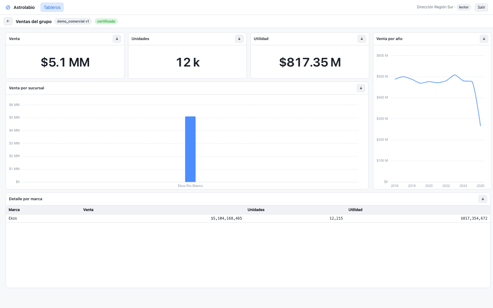

<p align="center">
  
</p>

<p align="center">
  <strong>Conectar, transformar, modelar y publicar.</strong><br>
  Una plataforma de inteligencia de negocios que se puede auditar: cada cifra
  se puede rastrear hasta la fila que la produjo.
</p>

<p align="center">
  <a href="LICENSE"></a>
  
  
  
</p>

---


## Qué es

Astrolabio hace el recorrido completo de una herramienta de BI, en un solo
programa que se instala en tu servidor:

1. **Conecta** a tus orígenes (MySQL/MariaDB, cualquier cosa con driver ODBC,
   archivos CSV/Excel/Parquet) y trae los datos a Parquet local.
2. **Transforma** con pasos visuales o con SQL pegado, y te dice cuántas filas
   entran y salen de cada paso.
3. **Modela**: entidades, relaciones y métricas en un lienzo, con las trampas
   clásicas —fan traps, rutas ambiguas, tablas huérfanas— detectadas y señaladas.
4. **Publica** tableros con filtros asociativos, y con seguridad por fila de
   verdad: dos personas abren el mismo tablero y ven cifras distintas, según lo
   que cada una tiene permitido ver.

Está pensado para una organización mediana que hoy paga licencias por usuario y
tiene un servidor donde instalarlo.

## Lo que lo hace distinto

**Las cifras se pueden comprobar.** No es un eslogan; son decisiones concretas que
están en el código y que se pueden verificar:

| | |
|---|---|
| **Se niega a adivinar** | Cuando hay dos caminos para cruzar dos tablas y dan cifras distintas, el motor **no elige uno**: pregunta cuál usar y guarda la respuesta en el tablero. La alternativa —elegir en silencio— es cómo una cifra cambia sin que nadie tocara nada |
| **Cuenta las filas de cada paso** | En una transformación se ve `500,000 → 469,985 → 36`. Un join que duplica filas es la causa número uno de un total inflado, y aquí se ve antes de publicar |
| **La base analítica se abre en solo lectura** | Nada de lo que pase por el ETL puede modificar una tabla que un tablero está leyendo |
| **Los tipos los declara el origen** | No se deducen de los datos. Dejando que se dedujeran, una carga reventó con `Casting value "1189519.10" to type DECIMAL(8,2)`; lo que asusta es la versión que no revienta y guarda dinero como texto |
| **El historial guarda los fallos** | Con el error, la hora y quién lo disparó. Es lo que se mira cuando una cifra no cuadra a las 3 de la mañana |
| **Y avisa cuando algo falla** | Por correo o webhook, con silencio entre repeticiones y aviso al recuperarse |

## En marcha en cinco minutos

```bash
git clone https://github.com/a831ard0/astrolabio.git
cd astrolabio/backend
python3 -m venv venv && ./venv/bin/pip install -r requirements.txt
./venv/bin/python demo/generar_datos.py    # datos ficticios: 11.5M filas, 8 s
./venv/bin/python demo/sembrar.py          # modelo, tablero y usuarios de ejemplo
./venv/bin/python -m uvicorn app.main:app --port 8000
```

En otra terminal:

```bash
cd astrolabio/frontend && npm install && npm run dev
```

Abre <http://localhost:5173> y entra con `admin@example.com` / `astrolabio-demo-2026`.

> **Entra después como `region@example.com`** (la misma contraseña) y abre el mismo
> tablero. Es la demostración de un minuto de lo que hace la seguridad por fila:
>
> | Administración | Dirección Región Sur |
> |---|---|
> |  |  |
> | $184.99 MM, 36 sucursales | $5.1 MM, la suya |
>
> No es un filtro que se pueda quitar: el predicado se inyecta en el SQL, y el
> total sin desglosar también viene filtrado.

Con Docker, sin instalar Python ni Node —vale igual en Linux, macOS y Windows—:

```bash
cp .env.ejemplo .env && docker compose up -d --build
```

Detalles, y lo que hay que saber de ODBC en un servidor Windows, en el
[manual técnico](docs/manual-tecnico.md).

## Las pantallas

<table>
<tr>
<td width="50%"><br><sub><b>Modelo.</b> Entidades y relaciones en un lienzo. El panel de diagnóstico marca las trampas: aquí detecta dos.</sub></td>
<td width="50%"><br><sub><b>Transformar.</b> Pasos visuales o SQL pegado, con el conteo de filas por paso y el SQL a la vista.</sub></td>
</tr>
<tr>
<td width="50%"><br><sub><b>Conexiones.</b> Se prueba antes de guardar, y no al revés. Las credenciales se guardan cifradas y no vuelven a salir.</sub></td>
<td width="50%"><br><sub><b>Flujos.</b> Cargar y recalcular en cadena, con un horario. Si un paso falla, los siguientes no corren.</sub></td>
</tr>
<tr>
<td width="50%"><br><sub><b>Avisos.</b> Correo o webhook cuando algo falla, con silencio entre repeticiones y aviso al recuperarse.</sub></td>
<td width="50%"><br><sub><b>Gobierno.</b> Usuarios, políticas de seguridad por fila, simulador («ver como otro») y auditoría.</sub></td>
</tr>
</table>

## Documentación

| Para | Dónde |
|---|---|
| Usar la herramienta | [Manual de usuario](docs/manual-usuario.md) |
| Instalar, desplegar, respaldar, actualizar | [Manual técnico](docs/manual-tecnico.md) |
| Entender por qué está hecho así | [Notas de ingeniería](docs/README.md) |
| Contribuir | [CONTRIBUTING.md](CONTRIBUTING.md) |
| Reportar un fallo de seguridad | [SECURITY.md](SECURITY.md) |

## Qué hay dentro

```
backend/     FastAPI + DuckDB + SQLite. El motor semántico está en backend/semantic/
frontend/    React + TypeScript. Sin framework de componentes: CSS propio
docs/        Manuales y las notas de por qué cada decisión
backend/demo/  Datos ficticios y semilla para ver el producto funcionando
```

- **DuckDB** para consultar, **Parquet** para guardar: los datos quedan en archivos
  que se leen con cualquier herramienta, no encerrados en un formato propio.
- **SQLite** para los metadatos. Es una decisión, no una limitación provisional:
  está razonada en [docs/adr/0001](docs/adr/0001-sqlite-para-metadatos.md).
- **Nada sale de tu servidor.** Ni telemetría, ni fuentes de un CDN, ni una llamada
  a internet en todo el producto.

## Estado

Funciona de punta a punta y está probado: **535 pruebas** automatizadas pasando, de
582 en total. Las 47 restantes se saltan solas si no hay un MySQL o un ODBC de
verdad a mano; con ellos, corren. Están las que comprueban que la seguridad por
fila filtra de verdad, las que ejecutan cada función del lenguaje de fórmulas
contra DuckDB y las que verifican que una muestra de filas no se salta las
políticas.

Lo que falta está escrito, sin adornos, en cada documento de fase. Lo más notable:
más conectores nativos (PostgreSQL, SQL Server, SQLite), una barra de selecciones
con atrás y adelante, y que el fin de un flujo dispare otro flujo.

## Licencia

**AGPL-3.0** — libre y gratis, también para uso comercial interno. Si quieres
ofrecerlo como servicio o incluirlo en un producto cerrado sin publicar tus
cambios, hay una [licencia comercial](COMERCIAL.md).

Copyright © 2026 Abelardo Wilfrido Ramírez García.
