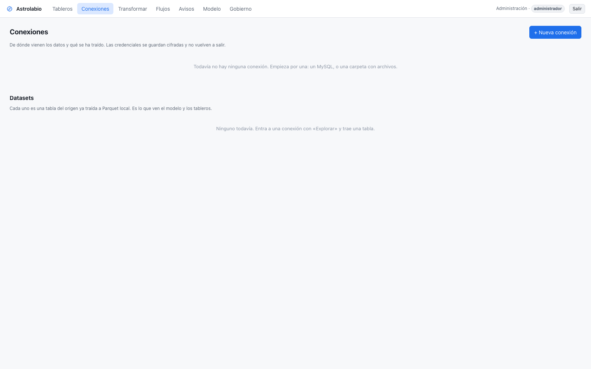
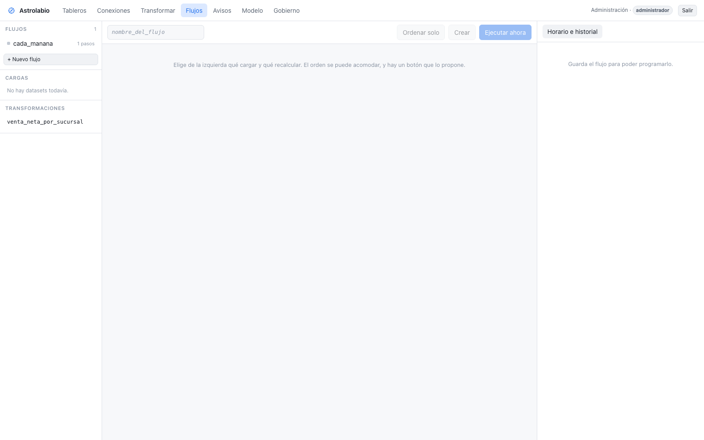
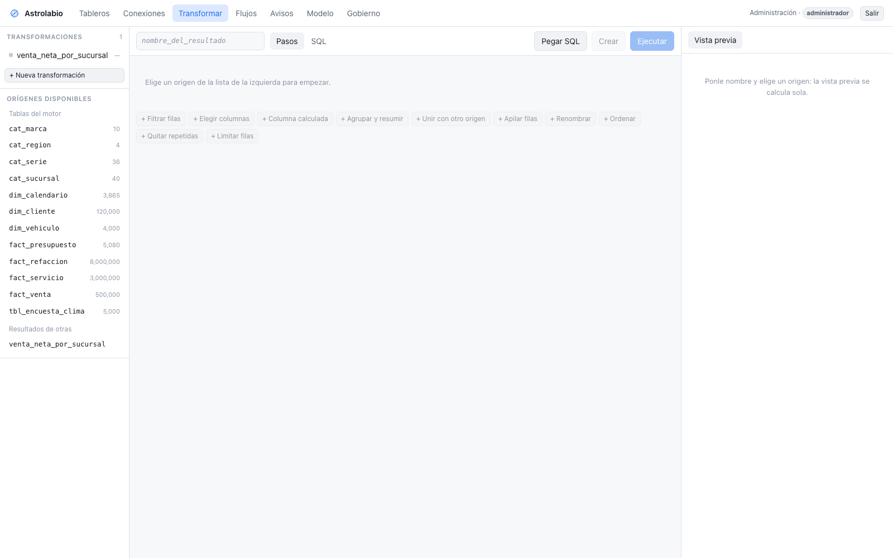
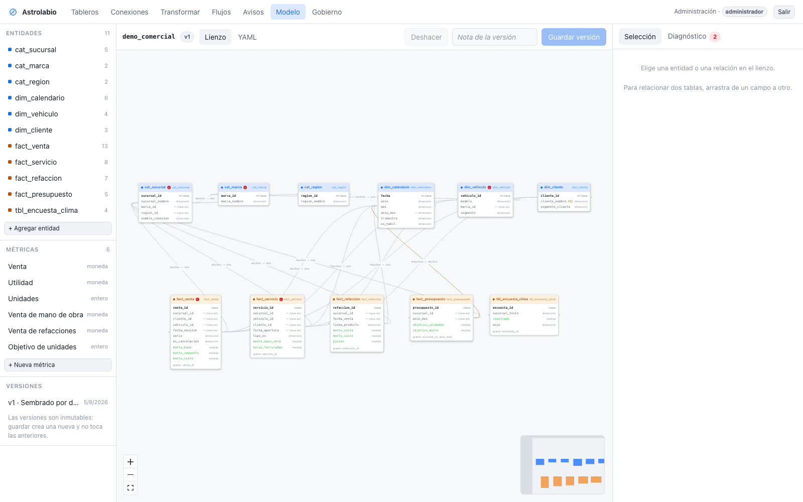
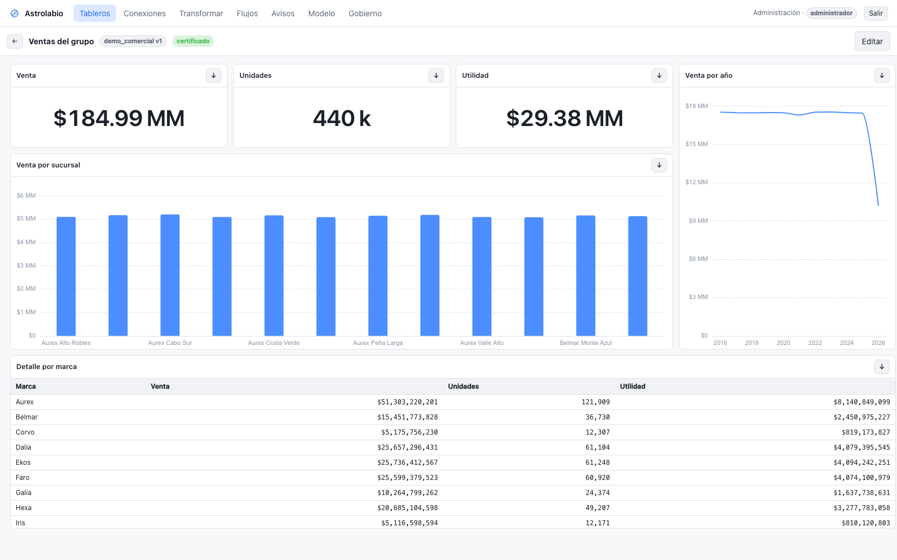
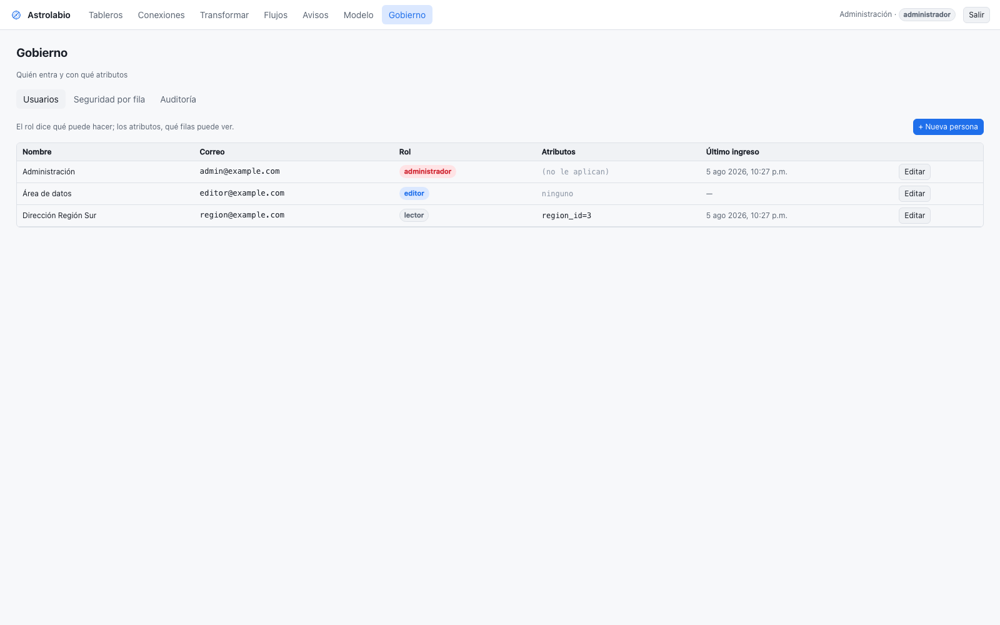
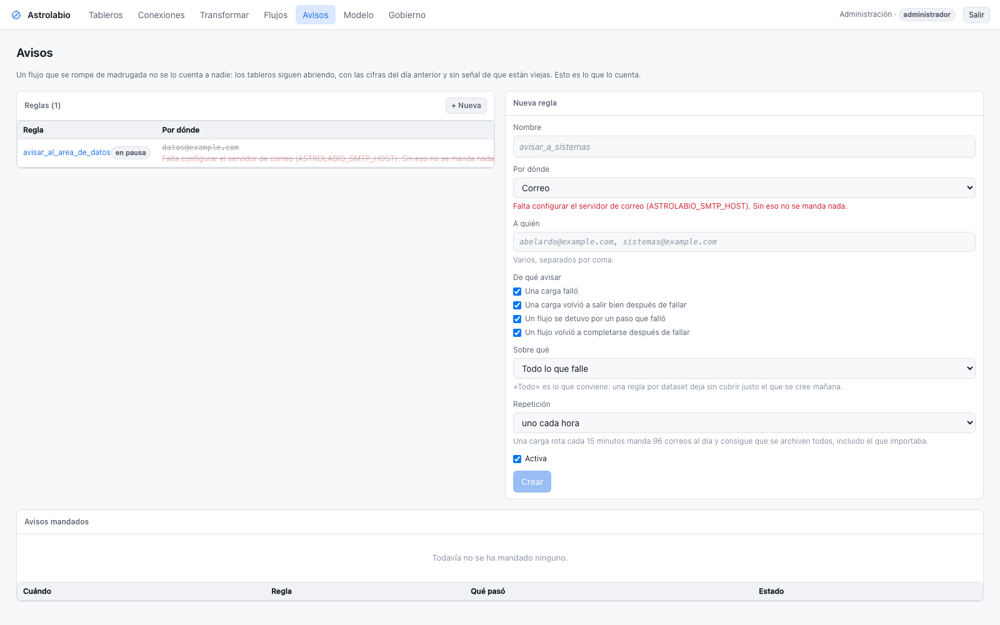

# Manual de usuario

Para quien va a usar Astrolabio: traer datos, transformarlos, modelarlos y
publicar tableros. No hace falta saber programar; sí ayuda saber qué significan
tus datos.

Si lo que buscas es instalarlo o mantenerlo, ese es el
[manual técnico](manual-tecnico.md).

**Índice**

1. [Entrar, y qué puede hacer cada quién](#1-entrar-y-qué-puede-hacer-cada-quién)
2. [Conectar a un origen](#2-conectar-a-un-origen)
3. [Traer una tabla: el dataset](#3-traer-una-tabla-el-dataset)
4. [Mantener los datos al día](#4-mantener-los-datos-al-día)
5. [Transformar](#5-transformar)
6. [El modelo: cómo se cruzan las tablas](#6-el-modelo-cómo-se-cruzan-las-tablas)
7. [Tableros](#7-tableros)
8. [Quién ve qué](#8-quién-ve-qué)
9. [Avisos cuando algo falla](#9-avisos-cuando-algo-falla)
10. [Preguntas frecuentes](#10-preguntas-frecuentes)

---

## 1. Entrar, y qué puede hacer cada quién

Hay tres roles. No se eligen por pantalla: los asigna un administrador.

| Rol | Puede |
|---|---|
| **Lector** | Ver los tableros publicados, filtrar y exportar. Solo las filas que le corresponden |
| **Editor** | Todo lo anterior, más conexiones, datos, transformaciones, modelo y tableros |
| **Administrador** | Todo, más usuarios, políticas y auditoría. **Las políticas no le aplican**: siempre ve todo |

Ese último punto importa: un administrador no puede comprobar una política mirando
sus propias pantallas. Para eso está el simulador (§8).

La primera vez, el administrador que se crea al arrancar sale en el registro del
servidor con una contraseña temporal. **Cámbiala al entrar**: no se vuelve a mostrar.

---

## 2. Conectar a un origen



**Conexiones → + Nueva conexión.** Hay tres tipos:

- **MySQL / MariaDB** — el conector nativo, el más rápido.
- **Archivos** — una carpeta del servidor con CSV, Excel o Parquet. Solo se lee de
  dentro de esa carpeta.
- **ODBC** — el comodín: Pervasive/Actian, SQL Server, Informix, PostgreSQL… Elige
  primero el **origen** y el formulario pide solo lo que ese driver necesita, porque
  cada uno llama distinto a lo mismo.

### Probar y luego guardar, en ese orden

El botón **Guardar** no se enciende hasta que la prueba sale bien, y **cualquier
cambio en la configuración invalida la prueba anterior**. No es una molestia: evita
probar contra un servidor, cambiar el servidor y guardar apoyado en un visto bueno
que ya no vale.

Si un botón está apagado, la línea de al lado dice por qué. Siempre.

### Las contraseñas

Se guardan cifradas y **no vuelven a salir nunca**, ni enmascaradas de forma
reversible.

Para cambiar una —rotar una contraseña, mover el servidor de máquina— está el botón
**Editar** de la conexión. Dos cosas que conviene saber:

- **El campo de contraseña sale en blanco, y en blanco significa "no la toques".**
  No se puede mostrar la guardada, así que se enseña vacía. Solo se cambia si
  escribes una nueva. Cambiar el puerto no te obliga a volver a teclear la
  contraseña.
- **El tipo y, en ODBC, el origen no se cambian.** Serían otra conexión, y los
  datasets que cuelgan de esta dejarían de tener sentido. Para eso, crea una nueva.

Editar prueba antes de guardar, igual que crear: si el cambio no conecta, no se
guarda y la conexión anterior sigue funcionando. Cambiar solo el nombre no necesita
prueba —el nombre es una etiqueta tuya, el servidor de datos no lo ve.

> Antes esto no existía y había que borrar la conexión y volver a crearla, **lo que
> se llevaba por delante todos sus datasets**: su historial, sus horarios y sus
> columnas elegidas.

> **Pide siempre un usuario de solo lectura** para cada origen. Astrolabio nunca
> escribe en tus sistemas, y un usuario con permisos de escritura solo puede
> hacer daño si algo sale mal.

---

## 3. Traer una tabla: el dataset

**Conexiones → Explorar → elige una tabla → Traer una tabla.**

Un *dataset* es una tabla de tu origen ya copiada a Parquet local. Se configura una
vez y a partir de ahí recargarla es un botón.

Lo que se decide al crearlo:

| Campo | Para qué | Consejo |
|---|---|---|
| **Nombre** | Con el que lo verás después | Sin espacios; es también el nombre del directorio |
| **Columnas** | Cuáles traer | Por defecto **todas**, y eso es lo que conviene dejar salvo que la tabla sea muy ancha |
| **Partir por** | Una columna de fecha | Permite recargar un mes sin tocar los demás |
| **Columna incremental** | Un id o fecha que solo crece | Hace que la segunda carga traiga solo lo nuevo |

### Sobre elegir columnas

La vista de muestra **se vuelve a pedir al origen** con las columnas elegidas, así
que ves exactamente lo que vas a traer. Si dejas todas, se guarda «todas» y no la
lista: así, cuando el origen agregue una columna el mes que viene, llegará sola.

Dos cosas que la pantalla no te deja hacer, porque fallarían de madrugada: dejar
fuera la columna de partición o la incremental, y dejarlo todo fuera.

**Si cambias las columnas de un dataset que ya cargó, la siguiente carga será
completa** y reescribirá todo. El archivo en disco tiene las columnas viejas, y
mezclar dos juegos haría que leerlo fallara o —peor— devolviera nulos.

### Cargar no bloquea la pantalla

**Cargar** y **Recargar completo** lanzan la carga y contestan enseguida: puedes
cerrar la ventana, o el navegador. El resultado aparece en el historial de ese
mismo panel, que se actualiza solo mientras corre.

Como los flujos, las cargas **hacen cola**: dos a la vez sobre el mismo origen no
acaban antes. Y **el mismo dataset dos veces a la vez se rechaza** — serían dos
procesos escribiendo los mismos archivos.

### ¿La primera carga trae todo?

Sí. El modo no se elige: sale del estado del dataset.

- Sin carga previa → **completa**.
- Con marca previa e incremental → **incremental** (solo lo nuevo).
- Con ventana móvil → **recarga de particiones** (ver abajo).

---

## 4. Mantener los datos al día

Hay cuatro formas, y sirven para cosas distintas:

| | Cómo | Cuándo |
|---|---|---|
| **A mano** | El botón «Cargar» | Probando, o corrigiendo algo puntual |
| **Horario del dataset** | Un cron por dataset | Una tabla que no depende de nada |
| **Horario del flujo** | Un cron para la cadena completa | **Lo normal.** Es el equivalente de una tarea de Qlik Sense |
| **Ventana móvil** | No es un disparador: es *qué* se recarga | Tablas donde las filas viejas cambian |

### Ventanas móviles

Una carga incremental trae lo **nuevo** y nunca vuelve a mirar lo que **cambió**. Si
una venta de hace tres semanas se corrige o se cancela, su id no cambia y el dato
se queda viejo para siempre.

Una ventana dice «recarga siempre este rango»: `el mes en curso`, `el mes en curso y
el anterior`, `los últimos 2 años`, `solo el día anterior`, `los últimos N días`…

El rango **se calcula cada vez que corre**, con la zona horaria del dataset. La
pantalla te dice qué haría hoy: *«El mes en curso y el anterior: del 2026-07-01 al
2026-08-05. Se recalcula en cada corrida.»*

«Cargar» respeta la ventana; **«Recargar completo» se la salta**.

### Pegar una consulta SQL

**Transformar → Pegar SQL.** Se puede escribir SQL normal contra lo que ya tienes:

```sql
SELECT * FROM SUC_CENTRAL__ventas WHERE anio = 2026
```

El nombre que pongas en el `FROM` se busca entre **lo que existe aquí**: las tablas
del motor, los datasets ya cargados, los resultados de otras transformaciones y las
tablas que llegaron de varias conexiones. No hace falta saber si detrás hay una
tabla o un Parquet particionado.

⚠️ **Tiene que existir aquí, no en la base de la que salieron los datos.** Una tabla
de tu MySQL o de tu Pervasive no se puede nombrar en una consulta hasta que la hayas
traído como dataset. Si el nombre no existe, la pantalla lo dice y sugiere el más
parecido, en vez de dejarte con un error del motor.

Dos botones: **Convertir a pasos** la traduce a la vista visual —y si algo no se
puede representar, dice exactamente qué—, y **Usar como SQL** la deja tal cual.

### Flujos



Un flujo es «cada día a las 6, carga estas tablas y **luego** recalcula estas
transformaciones». Los pasos van en orden y **si uno falla, los siguientes no
corren**: seguir recalculando sobre datos que no se cargaron produce un número que
parece fresco y no lo es.

En la lista de la izquierda, **lo que ya está en el flujo lleva una palomita** y
el título dice cuántas van («12 / 35»). Con cuarenta sucursales por veintiocho
tablas esa lista es de mil renglones: hay un filtro por nombre y una casilla
*Solo las que faltan* para no ir contando a ojo.

El botón **Ordenar solo** propone el orden correcto leyendo de qué lee cada
transformación. Es una propuesta, no un cambio automático.

⚠️ Un dataset con horario propio que además es paso de un flujo **se carga dos
veces**. A veces es lo que se quiere; conviene saberlo.

#### Encadenar flujos: que uno empiece cuando el otro acabe

Un flujo también puede ser **un paso de otro**. En la lista de flujos, el **+**
que aparece al pasar por encima lo pone como paso del que estás editando.

Es la respuesta a «primero la sucursal A, y cuando termine, la B». Con horarios no
se puede decir: no sabes cuánto va a tardar cada una, y cuarenta crones a las 6:00
no las ponen en fila — las ponen a pelearse por el mismo Pervasive. Un flujo
maestro que llame a los cuarenta sí lo dice exacto, y lleva **un solo horario**.

Cada eslabón corre entero, con **sus** reintentos y **su** regla al fallar, y deja
su propia entrada en su propio historial: en el maestro ves «hijo_a · 28 pasos ·
1,204,331 filas», y para saber cuál de esos 28 falló abres el hijo. Si un hijo
falla, el maestro se detiene igual que con cualquier otro paso.

Dos cosas que no se pueden hacer, y se avisan al guardar: que un flujo **se llame
a sí mismo**, y que dos flujos se llamen **en círculo**. Eso no daría un error
visible — daría un servidor dando vueltas de madrugada sin nadie mirando.

*Ordenar solo* no toca los pasos de tipo flujo: desde fuera no se puede saber qué
trae dentro cada uno.

**Se ve de dónde viene cada cosa.** En Tareas, un flujo al que llama un maestro ya
no dice «a mano» —era falso—: dice *dentro de «EXTRACTOR_ALL»*, y debajo del nombre
*lo llama «EXTRACTOR_ALL»*. Si además tiene horario propio, la columna dice las dos
cosas, porque entonces corre dos veces. En su historial, esas corridas aparecen como
*desde «EXTRACTOR_ALL»* en vez de *manual*, así que se puede reconstruir quién
disparó qué. Y el filtro *Sin horario* ya no los acusa: sí corren solos.

#### El horario se elige por partes, no en cron

Se elige **cada cuánto** (cada hora, todos los días, de lunes a viernes o a sábado,
un día de la semana, un día del mes), **a qué hora** en a. m./p. m., y **en qué
zona**. El cron se escribe solo y queda a la vista; si escribes ahí algo que no
encaja en esas formas —`*/15 * * * *`, por ejemplo— el selector se pone en
*Avanzado* en vez de mentir sobre lo que hay guardado.

La **zona** antes estaba fija en `America/Mexico_City`: era el valor por omisión de
la base de datos, no una elección. Ahora se elige de una lista con las once de
México por su nombre de a pie —Cancún, Hermosillo, Tijuana…— y el resto del mundo
debajo; un horario nuevo arranca en la zona de **tu navegador**, y si la guardada es
otra, la pantalla te dice cuál es la tuya. Importa: «las 6:00» en Cancún y en
Tijuana son tres horas de diferencia.

⚠️ El día del mes llega hasta **28** a propósito. Un `30` o un `31` se salta
febrero, y una carga que no corre un mes al año es de las que nadie nota.

#### Detener una cadena que ya arrancó

El botón **Detener** —en Flujos, junto al nombre, y también en el aviso de Tareas—
para un flujo que ya va corriendo.

**No corta la tabla en curso.** La que se está trayendo se termina, y los pasos que
faltan quedan como *detenidos*. Eso no es prudencia de más: el destino de una carga
**se borra antes de escribir**, así que una recarga completa cortada en el momento
justo dejaría el dataset **vacío**. Esperar la tabla en curso son minutos;
recuperar un dataset vacío, no.

En un maestro, detenerlo detiene también al hijo que esté corriendo —termina su tabla
y para—, y los hijos que faltaban no se lanzan.

La corrida queda como **detenido**, no como *falló*: en gris, no en rojo, y **sin
mandar el aviso de fallo**. Un correo de alarma por algo que acabas de hacer tú es la
forma de que esos correos se dejen de leer. En Tareas hay un filtro *Detenidos*.

#### Continuar donde se quedó

En el historial del flujo, una corrida **detenida o fallida** trae un botón
**Continuar**, con lo que va a hacer escrito al lado: *salta 19 · corre 19 · lo hecho
tiene 12 minutos*.

Continuar **se salta los pasos que ya salieron bien** y corre los demás. Los pasos
saltados aparecen como *ya estaba*, que no es lo mismo que *éxito* — el historial
tiene que poder decir cuál de las dos cosas fue.

Sirve igual para lo que **falló**, y ese es el caso frecuente: la sucursal 20 estaba
apagada a las 6, los pasos 1–19 salieron bien y del 21 al 38 quedaron omitidos.
Continuar arranca en el 20 en vez de volver a traer las 38.

Tres cosas que conviene entender:

- **Las transformaciones se rehacen siempre**, aunque hubieran salido bien. Continuar
  mezcla dos momentos —lo traído a la 1 y lo traído a las 6—; para cuarenta sucursales
  independientes eso da igual, pero una transformación que ya corrió con los datos de
  la 1 se quedaría vieja mientras sus orígenes se actualizan. Eso es justo el número
  que parece fresco y no lo es. Rehacerla cuesta poco: lee Parquet local.
- **La antigüedad se dice, no se prohíbe.** Si lo completado tiene tres días, la
  pantalla lo dice y tú decides. No hay un límite en horas porque cualquier número
  ahí sería inventado.
- **Los pasos se reconocen por lo que son, no por su número.** Si editas el flujo
  mientras está pausado, continuar sigue saltándose las tablas correctas, corre las
  nuevas, y te avisa de las que estaban en esa corrida y ya no están en el flujo.

Una corrida solo se puede continuar **una vez**: la que la continuó queda anotada
(*continúa #41*), y un segundo intento se rechaza diciendo cuál ya la retomó. Si de
verdad hay que repetirlo todo, se ejecuta el flujo completo.

⚠️ **Una carga suelta no se puede detener.** No tiene pasos donde pararse: o termina,
o se corta a la mitad. La pantalla lo dice en vez de ofrecer un botón que no
funcionaría.

#### Reintentos

Con cuarenta sucursales, que una esté apagada a las 6 de la mañana pasa seguido —
y a los dos minutos ya no lo está. Cada flujo dice **cuántas veces se reintenta
un paso** antes de darlo por fallido, y cuánto espera entre intentos.

Por omisión son **cero**, a propósito: reintentar sin que nadie lo pida esconde
un origen que va mal, y la primera vez que algo falla hay que verlo. Súbelo
cuando sepas que ese origen se cae a ratos.

Un éxito al tercer intento **no es lo mismo** que un éxito: el historial dice
cuántos intentos hicieron falta. Si un paso empieza a necesitar tres cada noche,
el problema no es el reintento.

### Tareas

**Tareas** es la pantalla de la mañana: todo lo que corre solo, en una sola tabla.
Los flujos y las cargas con horario propio aparecen juntos, porque a las 8 de la
mañana lo que importa es qué corrió anoche y cómo salió, no de qué tipo era.

Cada fila dice el horario, cuándo corrió por última vez, cómo salió y cuándo vuelve
a correr. El triángulo de la izquierda **despliega los pasos en su orden**, así que
no hay que abrir el flujo para saber qué hace.

Lo que falló sale arriba. Los filtros de la barra —*Fallaron*, *Corriendo*, *Bien*,
*Sin correr*, *Sin horario*— y el buscador, que también busca por tabla y por
conexión, sirven para responder «¿quién carga esta tabla?».

Aquí no se edita nada: **Abrir** lleva a Flujos o a Conexiones **con esa tarea ya abierta** — no hay que volver a buscarla entre las demás. **Ejecutar** lanza un flujo a mano.

#### Ejecutar a mano: corre en segundo plano

**Ejecutar** no se queda esperando. Un flujo de veintiocho tablas por el puente
tarda minutos; tener la pantalla esperando todo ese rato terminaba en un *Error
502* del proxy aunque el servidor siguiera trabajando. Ahora la corrida se lanza
y se sigue por el historial: **puedes cerrar la pantalla, o el navegador**.

Si ya hay algo corriendo, Astrolabio pregunta:

- **Esperar turno** (lo normal). Se pone en cola y arranca cuando acabe lo de
  antes. Si los dos leen del mismo servidor de origen, lanzarlos a la vez no
  acaba antes — y a veces acaba peor.
- **Correr ya, a la par**. Arranca de inmediato. Tiene sentido cuando son
  sucursales en servidores distintos.

Mientras corre **se ve por dónde va**: el paso en curso queda marcado como
*trayendo…*, los que ya acabaron enseñan sus filas y su tiempo, y arriba dice
«va por el paso 7 de 28». Se actualiza solo, sin recargar.

Arriba de la tabla aparece una barra con lo que corre y lo que espera turno; de
la cola se puede sacar algo que **todavía no empezó**. Lo que ya arrancó no se
corta: a mitad de una ingesta, cortar deja el destino a medias.

**El mismo flujo dos veces a la vez se rechaza**, y eso no se pregunta: serían
dos procesos escribiendo los mismos archivos.

### Etiquetas: de qué sucursal viene cada fila

**Conexiones → Etiquetas.**

Cuarenta agencias con el mismo sistema dan cuarenta veces la misma tabla. Una vez
juntas, nada dice de cuál venía cada fila — y ese dato no está en el origen,
porque allá cada base es «la base».

Una etiqueta es una **constante de la conexión** que sale como **columna** al leer
cualquiera de sus datasets: `id_sucursal = 3` en una, `= 5` en otra. Es el
equivalente exacto de la variable por sucursal de un script de Qlik.

Se editan **todas juntas**, en una tabla de conexiones × etiquetas: ir una por una
cuarenta veces es justo el trabajo que esto quita. La flecha ↓ copia el primer
valor a las vacías, para las etiquetas que casi siempre son la misma (la marca,
el país). Si dos conexiones acaban con el mismo valor, la celda se marca en
ámbar: casi siempre es un dedazo.

**No se escriben en los archivos.** Se agregan al leer, así que corregir un
número no obliga a volver a extraer nada.

> Si una etiqueta se llama igual que una columna de la tabla, la transformación
> se detiene y lo dice. Cámbiale el nombre a la etiqueta.

### La misma tabla de todas las conexiones

En **Transformar**, la lista de orígenes tiene un apartado *La misma tabla en
varias conexiones*: eliges `Funcionarios` una vez y se apilan las cuarenta, cada
una con las etiquetas de su conexión. No hay que enumerar cuarenta datasets ni
acordarse de agregar el cuarenta y uno cuando abra una agencia nueva.

- Se apila **por nombre de columna**: una sucursal con una columna de más —o de
  menos— no tumba a las otras treinta y nueve. Lo que falte llega en nulo.
- Si a alguna le faltan datos, **se detiene y la nombra**. Devolver un total al
  que le faltan sucursales sin que nadie lo note hace más daño que un fallo.

El contador `38/40` de al lado dice cuántas están cargadas.

Con eso, el `If(...)` de tu script de Qlik es una **columna calculada** y la
variable de sucursal es la etiqueta:

```sql
CASE
  WHEN LEFT("Nm Funcionario", 3) = 'HU-'  THEN 3
  WHEN LEFT("Nm Funcionario", 4) = 'PTO-' THEN 5
  WHEN LEFT("Nm Funcionario", 3) = 'VW-'  THEN 1
  ELSE id_sucursal
END
```

---

## 5. Transformar



**Transformar** es donde se limpia y se resume: filtrar, unir, agrupar, derivar
columnas, apilar, ordenar. Dos formas de trabajar, y se puede saltar de una a otra:

- **Por pasos**, eligiendo de listas que salen del esquema real (no se puede elegir
  una columna que no existe).
- **Pegando SQL**, si ya lo tienes escrito. Y se puede convertir de vuelta a pasos.

### Lo que más vas a usar: el conteo por paso

```
origen: fact_venta                 500,000
unir con sucursales (izquierda)    500,000
filtrar: 1 condición(es)           469,985    -30,015
derivar: neto                      469,985
agrupar: por 1, 3 agregado(s)           36   -469,949
```

De un vistazo se ve que **la unión no duplicó filas** (500,000 → 500,000, o sea que
de verdad es muchos-a-uno), que el filtro quitó 30,015 cancelaciones y que quedaron
36 sucursales. Un join que duplica filas es la causa número uno de un total
inflado, y aquí se ve antes de publicar nada.

### Al convertir SQL a pasos: no se adivina

Si algo no se puede representar (funciones de ventana, `HAVING`, subconsultas,
CTEs…), **se dice cuál y por qué**, y no se convierte. Una conversión aproximada es
peor que ninguna: seguirías editando unos pasos que dicen otra cosa.

### Cambiar el nombre

El nombre no es solo una etiqueta: es la **carpeta en disco** donde vive el resultado
y el nombre con el que **otras transformaciones lo leen**. Aun así se puede cambiar.

Escribe el nombre nuevo en el cuadro de arriba y aparece un botón **Renombrar**. Al
pulsarlo se mueven los datos y se arreglan solas las transformaciones que la leían;
después la pantalla te dice exactamente qué se tocó.

Lo que no se toca, a propósito:

- **Las versiones del modelo.** Son instantáneas que no se reescriben, para que un
  tablero publicado no cambie de significado porque alguien renombró algo. Si alguna
  nombra esa tabla, **no se renombra** y se te dice qué modelo es. La salida es sacar
  esa entidad del modelo, o crear otra transformación con el nombre nuevo.
- **El alias de los orígenes.** Es el nombre con el que tu consulta o tu paso de unir
  la llaman por dentro; cambiarlo rompería el SQL que escribiste.

Un nombre que ya use otra transformación o un dataset se rechaza: los dos escribirían
en el mismo sitio. Y renombrar **no** lo hace el botón *Guardar* — guardar cambia qué
calcula, renombrar mueve archivos, y son dos cosas distintas.

### Proyectos y secciones

Una transformación sola está bien para una cosa suelta. Cuando son dieciocho que van
juntas —limpiar series, armar el calendario, calcular los hechos de venta, los de
servicio— tenerlas sueltas en una lista plana no dice qué va con qué, y con cuarenta
sucursales deja de ser manejable.

Para eso está el **proyecto**: un grupo de transformaciones que corren en orden, con
un solo horario. Es lo mismo que un script con secciones.

```
▾ PROYECTOS                              1
  ▾ TRANSFORMADOR_VENTAS              4    ▶
      éxito  tramo desde 3   8/8/2026, 6:04 a.m.
      1 ● series                    int
      2 ● calendario                int
      3 ● hechos_venta          469,985
      4 ● hechos_servicio       128,400
    + Sección      Borrar proyecto
▾ SIN PROYECTO                           2
```

- **Crear uno**: escribe el nombre abajo de la lista y pulsa *Crear*. Nace vacío.
- **Meterle transformaciones**: despliega el proyecto y pulsa el `+` de cualquiera de
  las de *Sin proyecto*. O pulsa *+ Sección* para crear una nueva ya dentro.
- **Ordenarlas**: con `↑` y `↓`. **El número que se ve es el paso en el que corre.**
- **Sacar una**: la `✕` la deja suelta. **No la borra** y no toca sus datos: sacar
  algo de una carpeta no es tirarlo.

El punto de color de cada sección dice cómo salió la última vez, así que de un golpe
se ve cuál de las dieciocho es la que rompe.

Borrar el proyecto borra el orden y el horario. **Las secciones quedan sueltas, con
sus datos**: pueden estar alimentando un tablero.

Lo que ya tenías no cambia. Las transformaciones de antes siguen donde estaban, ahora
bajo *Sin proyecto*, y se mueven cuando tú decidas dónde van.

#### Ejecutar solo una parte

El `▶` del proyecto corre las secciones en orden, de la primera a la última.

El `▶` de una **sección** corre **de ahí al final**. Es lo que se usa a diario:
cuando estás afinando la sección 12 de dieciocho, rehacer las once anteriores son
veinte minutos de espera por nada.

Las secciones anteriores quedan anotadas como **«no se pidió»** —que no es lo mismo
que «salió bien» ni que «se omitió por un fallo»— y la corrida se marca **«tramo
desde 3»**. Esa marca importa: sin ella, dos secciones en verde de dieciocho se leen
como *el proyecto está al día*, y no lo está. Los datos de las que no se pidieron son
de antes.

Por lo mismo, un tramo que sale bien no manda el correo de «ya se arregló»: lo que
fallaba puede ser justo lo que no se pidió.

#### Secciones intermedias

Marca **intermedia** una sección que es andamiaje: un mapeo de códigos, la tabla de
series, un calendario auxiliar. Su resultado se sigue calculando y guardando —es lo
que permite ejecutarla sola y ver sus filas— pero **solo se ofrece como origen dentro
de su propio proyecto**, y no aparece en las listas de datos ni se puede usar en un
modelo.

Con dieciocho secciones por sucursal, sin esta marca el catálogo se llena de tablas
de andamiaje que nadie va a graficar.

#### Un proyecto dentro de un flujo

Por dentro, un proyecto **es** un flujo al que solo se le pueden poner
transformaciones. De ahí que tenga horario propio, salga en *Tareas* y se detenga con
el mismo botón que todo lo demás.

Y de ahí también que un flujo pueda llamarlo como un paso, que es el caso útil: el
maestro trae las cuarenta sucursales y después llama al proyecto que las transforma.
En la pantalla de *Flujos*, los proyectos salen en su propia lista y solo se pueden
encadenar — editarlos se hace aquí, donde sus pasos son secciones.

### Encontrar algo entre mil orígenes

Los orígenes están agrupados y **cada grupo se pliega** pulsando su título, con su
contador al lado. Lo que no uses se quita de en medio una vez y se queda quitado — se
recuerda por pantalla y por navegador.

Arriba hay un **buscador** que no se desplaza. Escribe trozos, en el orden que sea:

```
oriente presu     →  SUC_ORIENTE__presupuesto
orcamento         →  SUC_SUR__Orçamento_Produtos
```

No hace falta acertar los acentos, las mayúsculas ni los guiones bajos. La cabecera te
dice cuántos coinciden («23 de 1,065»), y si un grupo estaba plegado **se abre solo**
mientras haya resultados dentro; al limpiar la búsqueda vuelve a plegarse.

El mismo buscador está en *Proyectos*, y ahí un proyecto aparece si coincide su nombre
**o el de una de sus secciones**: buscar `hechos_venta` te lleva al proyecto que la
tiene sin abrirlos uno por uno.

> Si buscas algo y no aparece, acuérdate de que aquí solo está **lo que ya se trajo**.
> Una tabla de tu MySQL o de Pervasive no aparece hasta que existe como dataset.

### El panel de la izquierda

Con cuarenta sucursales, el nombre de un dataset es el de la conexión más el de
la tabla —`SUC_SUR__Orcamento_Produtos`— y no cabe. **Arrastra el borde
derecho del panel** para ensancharlo; doble clic lo devuelve a su ancho normal.
El ancho se recuerda por pantalla.

Y **cada sección se pliega** pulsando su título. Plegar las que no estás usando
le da su alto a la que sí.

---

## 6. El modelo: cómo se cruzan las tablas



El modelo dice qué es cada tabla (dimensión o hecho), cómo se relacionan y qué
métricas existen. Se dibuja arrastrando de un campo a otro.

### Crear uno

**Modelo → + Nuevo modelo.** Se pide el nombre y **la primera tabla**, en el mismo
paso: un modelo sin ninguna entidad no se puede guardar, así que un «crear» que lo
dejara vacío estaría prometiendo algo que no se cumple. Lo demás —más tablas, las
relaciones, las métricas— se arma en el lienzo.

En el desplegable de tablas sale **todo lo que se puede modelar**, en tres grupos:

| Grupo | Qué es |
|---|---|
| **Tablas del motor** | Las que viven dentro del archivo analítico |
| **Datos cargados** | Las tablas que trajiste de tus orígenes |
| **Resultados de transformaciones** | Lo que produjeron tus transformaciones |

Los dos últimos grupos son Parquet, no tablas, y aun así se usan igual: se les pone
una vista encima al consultarlos. Dos consecuencias prácticas: **un Parquet no
declara clave primaria**, así que hay que marcar cuál es en la lista de columnas —o
dejarla sin clave, y el diagnóstico avisará de que falta el grano—; y **los datos
frescos se ven solos**, sin reiniciar nada, porque la vista se resuelve en cada
consulta.

Si un resultado tuyo se llama igual que una tabla del motor, **gana la del motor**:
es lo que ya estaban leyendo los tableros. Las secciones marcadas como
**intermedias** no aparecen aquí; son andamiaje de una transformación.

**Las métricas se definen una vez.** «Utilidad» es una fórmula que vive en el
modelo, no algo que cada quien reescribe en su tablero. Es lo que hace que dos
personas no tengan dos utilidades distintas.

### Ordenar las métricas: tablas de medidas

Una métrica sale en el panel con su signo **Σ**, así que no se confunde con una
tabla ni con una columna. Y se pueden agrupar en **tablas de medidas**: cajones que
tú inventas —«KPIs de venta», «KPIs de taller»— con **+ Tabla de medidas**. Es lo
mismo que en Power BI, incluido lo importante:

- **No son entidades.** No tienen datos, no se relacionan con nada y no aparecen en
  el lienzo ni en el diagnóstico. Solo ordenan.
- **No cambian ninguna cifra.** En la métrica hay dos campos distintos a propósito:
  **Calcula desde** es el hecho —lo que decide de dónde sale el número— y **Aparece
  en** es el cajón. Mover una métrica de cajón no le toca el resultado.
- Lo que no esté en ningún cajón sigue viéndose **bajo su hecho**, como antes.

Quitar un cajón (`✕`) **no borra sus métricas**: vuelven a verse bajo su hecho.
Cambiarle el nombre (`✎`) arrastra a las suyas con él.

### El panel de diagnóstico

Marca los problemas que producen cifras mal sin avisar:

| Problema | Qué significa |
|---|---|
| **Ruta ambigua** | Hay dos caminos para cruzar dos tablas y dan resultados distintos. Al usarlo, el tablero te pide elegir cuál, y guarda tu respuesta |
| **Fan trap** | Unir dos hechos de distinto grano infla los totales al sumar |
| **Tabla huérfana** | No se relaciona con nada; sus cifras no se pueden cruzar |
| **Falta el grano** | Sin saber qué es una fila, no se puede detectar lo anterior |

Que aparezcan no significa que esté mal: significa que hay una decisión que tomar,
y que la herramienta no la va a tomar por ti en silencio.

### Versiones

Guardar el modelo **crea una versión nueva**; las anteriores no se tocan. Cada
tablero está anclado a una versión concreta, así que cambiar el modelo no rompe en
silencio lo ya publicado.

---

## 7. Tableros



**Tableros → + Nuevo tablero.** Se arrastran widgets y se colocan a gusto: KPI,
barras, líneas, pastel, tabla.

Cada widget lleva dimensiones (por qué se desglosa) y métricas (qué se mide), y
salen de listas del modelo.

### Filtros asociativos

Al hacer clic en un valor, **todo el tablero se filtra**, y los demás filtros
muestran qué valores siguen siendo posibles con esa selección y cuáles ya no. Es el
comportamiento al que uno se acostumbra en Qlik.

### Exportar

Cada widget tiene su flecha: **Excel** o **CSV**. El archivo lleva una hoja con el
contexto —qué filtros estaban puestos, qué versión del modelo, quién lo exportó y
cuándo— para que una tabla que alguien manda por correo siga diciendo de dónde salió.

---

## 8. Quién ve qué



**Gobierno** (solo administradores) tiene tres pestañas.

**Usuarios.** Alta, rol y *atributos*. Un atributo es un dato de la persona —por
ejemplo `region_id = 3`— que las políticas usan para filtrar.

**Seguridad por fila.** Una política es una condición que se añade a **todas** las
consultas de quien le aplica:

```
entidad:   cat_sucursal
predicado: region_id = {{ usuario.region_id }}
aplica a:  lector
```

Tres cosas que conviene saber:

- El filtro **no se puede quitar** desde el tablero: se inyecta en el SQL.
- **También filtra el total.** Aunque no desglose por sucursal, la cifra viene
  filtrada. Si no fuera así, el gran total delataría lo que la persona no ve.
- **Falla cerrado**: si a alguien le falta el atributo que la política necesita, no
  ve nada en vez de verlo todo.

**Simulador.** «Ver como» otro usuario, sin su contraseña. Muestra qué políticas le
aplican, con qué valores, y qué cifras le salen. Es la única forma de que un
administrador compruebe una política, porque a él no le aplican.

**Auditoría.** Quién hizo qué y cuándo: ingresos, ingresos fallidos, consultas,
cargas, cambios de política. **No se puede borrar** — un registro que se puede
limpiar no sirve para lo único que existe.

---

## 9. Avisos cuando algo falla



Un flujo que se rompe de madrugada no se lo cuenta a nadie: los tableros siguen
abriendo, con las cifras del día anterior y sin ninguna señal de que están viejas.

Una **regla de aviso** dice a quién contárselo, por **correo** o por **webhook**
(Teams, Slack). Por defecto cubre todo lo que falle, que es lo que conviene: una
regla por dataset deja sin cubrir justo el que se cree mañana.

- **Prueba la regla** con el botón que está a su lado. Un canal que nadie probó no
  es cobertura, es creer que la hay.
- **Repetición**: una carga rota cada 15 minutos mandaría 96 correos al día y
  conseguiría que se archiven todos. Por eso se manda uno y se callan los
  siguientes durante el tiempo que elijas.
- **También avisa al recuperarse**, que es la otra mitad: si no, nadie sabe si
  sigue roto.

Si el correo no está configurado en el servidor, la propia regla lo dice en rojo.

---

## 10. Preguntas frecuentes

**¿Los datos salen de mi servidor?**
No. No hay telemetría, ni fuentes de un CDN, ni ninguna llamada a internet.

**¿Puedo seguir usando Excel?**
Sí: cualquier widget exporta a Excel o CSV con su contexto.

**Una cifra no cuadra con mi sistema origen. ¿Por dónde empiezo?**
1. **Historial del dataset**: ¿cuándo fue la última carga buena?
2. **Conteo por paso** en la transformación: ¿dónde cambia el número?
3. **SQL a la vista** en el tablero (editores y administradores lo ven).
4. **Auditoría**: ¿alguien cambió el modelo o una política?

**¿Por qué el tablero me pide elegir un camino?**
Porque hay dos formas legítimas de cruzar esas tablas y dan cifras distintas. Elige
la que corresponde a tu pregunta; queda guardada en el tablero y ya no vuelve a
preguntar.

**Cambié el modelo y el tablero sigue igual.**
Es a propósito: el tablero está anclado a una versión. Ábrelo y actualízalo a la
versión nueva cuando quieras.

**¿Cuántos datos aguanta?**
Las pruebas corren sobre 11.5 millones de filas en una laptop, con respuestas por
debajo del segundo. El límite práctico es la memoria del servidor.

**¿Se puede en inglés?**
Hoy no; toda la interfaz está en español. Las traducciones son bienvenidas
([CONTRIBUTING.md](../CONTRIBUTING.md)).
